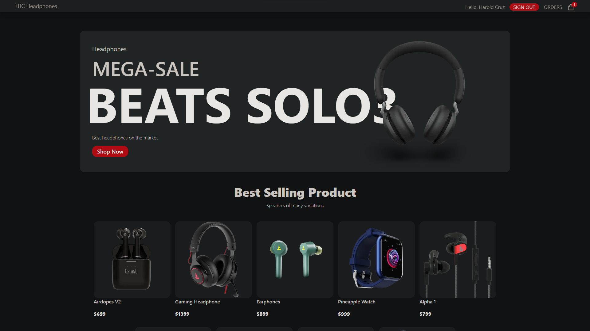

# HJC Ecommerce

This is an online selling platform I made for my items and I built this with [React](https://reactjs.org/), [Firebase](https://firebase.google.com/) and [Sanity](https://sanity.io)  .

## The challenge

Users should be able to:

- View the optimal layout for the site depending on their device's screen size
- See hover states for all interactive elements on the page

### Screenshot

### Links

- Live Site URL: [HJC Headphones](https://cruz-ecommerce.netlify.app/)

## My process
 
 -to follow
 
## Difficulties

 -to follow

## My Solution

 -to follow

### Built with

- [React](https://reactjs.org/) - JS library
- [Vite](https://vitejs.dev/) - Buildtool
- [ReactIcons](https://react-icons.github.io/) - For Icons
- [Tailwindcss](https://tailwindcss.com/) - For Styles
- [Framer-motion](https://www.framer.com/motion/) - For Arrow animation
